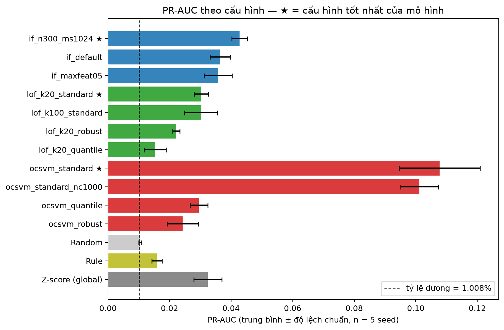
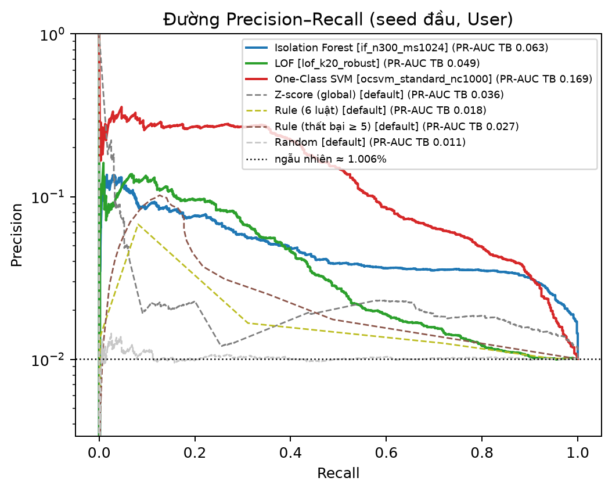
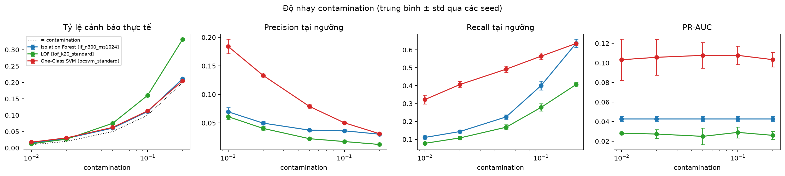
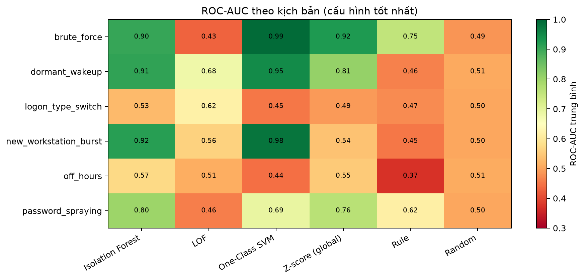
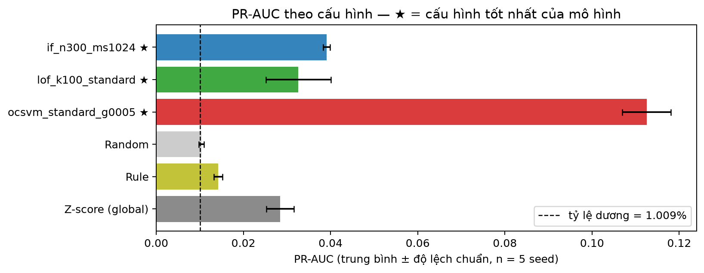
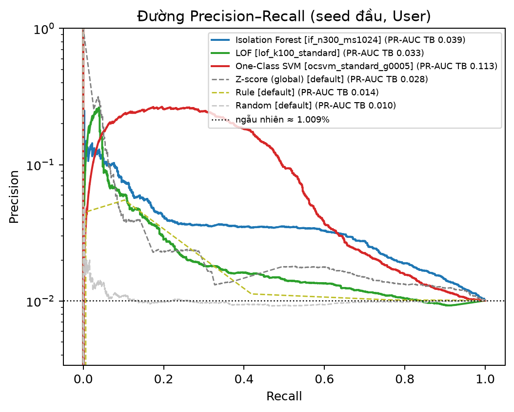

# Báo cáo tóm tắt Tuần 4: Đánh giá & tinh chỉnh

**Nhánh:** `feature/target-rate-1pct` (PR #10) · **Test:** 232/232 pass
**Đầu ra theo đề cương:** bảng benchmark 3 mô hình × ≥ 3 cấu hình; biểu đồ PR và độ nhạy contamination;
kết quả lặp trên 5 seed kèm độ lệch chuẩn.
**Số liệu gốc:** [`experiments/grid/dev/`](../../experiments/grid/dev/) (khối dev) · [`experiments/grid/test/`](../../experiments/grid/test/) (khối test)
**Hướng dẫn chạy lại:** [`docs/week4_benchmark_grid.md`](../../docs/week4_benchmark_grid.md)

---

## 1. TL;DR

1. Có **bộ sinh 6 kịch bản tấn công**, gồm 4 kịch bản đề cương yêu cầu và 2 kịch bản bổ sung. Bộ sinh chỉ nhân bản sự kiện thật của train.
   Mỗi run tiêm đúng **1% số dòng (tài khoản, ngày) User**, tức 736 nhãn dương, đúng mức 0,5–1% của mục 5.2.
2. Lưới benchmark gồm **3 mô hình × 3–6 cấu hình × 5 seed**, đặt cạnh 3 baseline (ngẫu nhiên, luật ngưỡng, z-score toàn cục).
   Một seed là một cặp (bộ dữ liệu tiêm, `random_state` mô hình).
3. Trên khối **test** (chạy một lần, cấu hình chốt trên dev), **One-Class SVM** đạt PR-AUC **0,113 ± 0,006**, gấp khoảng **4 lần z-score** (0,028) và **11 lần ngẫu nhiên** (0,0104).
   Kết quả này khớp với dev (0,112 ± 0,005). Mô hình bắt được **27,5%** nạn nhân trong ngân sách 100 cảnh báo/ngày.
4. **Phát hiện quan trọng nhất:** `RobustScaler` làm lệch thang đo đặc trưng và làm hỏng LOF/OCSVM.
   Chỉ cần đổi scaler, PR-AUC của OCSVM tăng từ 0,024 lên 0,108. Lỗi được tìm ra bằng một chuỗi kiểm tra có hệ thống, xem §5.1.
5. Kịch bản có lần đăng nhập thất bại, nguồn mới hoặc tài khoản ngủ đông bị bắt tốt (ROC-AUC 0,90–0,99).
   **Ngoài giờ** và **đổi LogonType** thì không mô hình nào bắt được, vì bộ đặc trưng hiện tại không có tín hiệu đủ mạnh cho hai kịch bản này.

## 2. Bộ sinh bất thường tổng hợp

### 2.1. Nguyên tắc

- **Không bịa giá trị trường.** Mọi sự kiện tiêm đều nhân bản từ sự kiện thật của train: của chính nạn nhân nếu có, nếu không thì của tài khoản cùng loại.
- **Chỉ dùng train để dựng hồ sơ** (ngày ≤ 42), và không sửa train. Bộ tiêm ghi vào tầng log interim, sau đó tính lại toàn bộ đặc trưng trên log đã tiêm.
  Vì vậy nhãn phản ánh đúng tác động của tấn công lên đặc trưng, gồm cả đặc trưng lịch sử 7 ngày.
- **Khối dev (ngày 43–51)** dùng để tinh chỉnh. **Khối test (ngày 52–60)** chỉ chạy một lần với cấu hình đã chốt.
- Mỗi run có `labels.parquet` (nhãn, kịch bản, campaign), `injection_manifest.csv` (một dòng cho mỗi lần tiêm kèm tham số thực tế) và `run_config.json`.

### 2.2. Sáu kịch bản

| Kịch bản | Hành vi được tiêm | Đề cương |
|---|---|---|
| `brute_force` | 8–25 lần 4625 (LogonType 3) từ một nguồn mới, dồn trong 5–30 phút; 5 lần sai mật khẩu rồi các lần sau bị khoá | ✔ brute-force |
| `off_hours` | **Thêm** chuỗi 10–40 sự kiện 4624 (sao chép từ một ngày train của chính tài khoản) vào khung 0–6 giờ; hoạt động ban ngày giữ nguyên | ✔ ngoài giờ bất thường |
| `new_workstation_burst` | Đăng nhập thành công từ 4–10 máy nguồn chưa từng thấy trong train | ✔ bùng nổ máy trạm mới |
| `dormant_wakeup` | Một ngày hoạt động đầy đủ, cấy vào sau một khoảng im lặng dài | ✔ ngủ đông thức dậy |
| `password_spraying` | Một nguồn gây 1–3 lần thất bại cho 5–10 tài khoản trong cùng ngày, có `campaign_id` (chiến dịch trải 9–23 giờ, không đồng thời) | bổ sung |
| `logon_type_switch` | 3–10 lần 4624 với LogonType tài khoản chưa từng dùng | bổ sung |

### 2.3. Tỷ lệ tiêm 1%

- **Mẫu số** là số dòng (tài khoản, ngày) User của khối, đếm trên log gốc: 72.845 dòng ở dev.
- **Tổng số lần tiêm** N = ⌈1% · D / (1 − 1%)⌉ = 736, chia đều cho 6 kịch bản (122–123 mỗi kịch bản). Nếu một kịch bản thiếu ứng viên, phần thiếu được chia lại cho các kịch bản còn lại.
- **Kết quả:** cả 5 run dev đều đạt **736 / 72.845 = 1,01%** và không kịch bản nào thiếu.
- Bản trước dùng số nạn nhân cố định, chỉ được 92 dương (0,13%), không đạt mục 5.2. Kết quả của bản đó được giữ ở
  `experiments/injection_runs/dev_seed20261043_rate013/` để đối chiếu.
- Chỉ phân khúc User được tiêm, vì 6 kịch bản đều là hành vi của tài khoản người dùng. Phân khúc Machine không có nhãn dương nên không có PR-AUC.

## 3. Thiết kế thực nghiệm

| Hạng mục | Lựa chọn | Lý do |
|---|---|---|
| Chia tập | Theo thời gian: train = ngày 1–42 (314.847 dòng User), đánh giá = đúng các ngày của khối | Không rò rỉ tương lai (mục 5.1) |
| Tiền xử lý | Imputer median và scaler **chỉ fit trên train** của phân khúc | Chống rò rỉ |
| Seed | 5 cặp (run tiêm `dev_seed20261043…47`, `random_state` 42/7/2024/1/2) | Độ lệch chuẩn gồm cả biến động dữ liệu tiêm lẫn biến động mô hình |
| Ngưỡng cảnh báo | Phân vị (1 − contamination) của điểm **train**, contamination = 0,05 | Không dùng nhãn để đặt ngưỡng |
| Chọn cấu hình | PR-AUC trung bình 5 seed cao nhất trên **dev** | Không chọn trên test |
| Chỉ số | PR-AUC, ROC-AUC, P@10/50/100, recall tại ngân sách, recall top-N/ngày, tỷ lệ cảnh báo, precision/recall/F1 tại ngưỡng, thời gian fit và suy luận | Mục 4.1 #5 |

**Lưới cấu hình** (`configs/benchmark_grid.yaml`):

| Mô hình | Cấu hình | Tham số quét |
|---|---|---|
| Isolation Forest | 3 | `n_estimators` 150/300, `max_samples` auto/1024, `max_features` 1,0/0,5 |
| LOF (HNSW) | 4 | scaler robust/standard/quantile × `n_neighbors` 20/100 |
| One-Class SVM (Nystroem + SGD) | 6 | scaler robust/standard/quantile, `gamma` scale/0,005/0,1, `n_components` 300/1000 |
| *Contamination* | 5 mức | 0,01 / 0,02 / 0,05 / 0,10 / 0,20, chạy trên cấu hình tốt nhất của mỗi mô hình (`nu` = contamination với OCSVM) |

Isolation Forest không phụ thuộc vào phép scale đơn điệu theo từng cột (đã kiểm chứng: robust và standard cho kết quả giống hệt), nên với IF chỉ quét siêu tham số.

## 4. Kết quả trên khối dev (User, trung bình ± độ lệch chuẩn qua 5 seed)

### 4.1. Bảng benchmark đầy đủ

| Mô hình | Cấu hình | PR-AUC | ROC-AUC | P@50 | P@100 | Recall@ngân sách 5% | Recall top-100/ngày | Tỷ lệ cảnh báo |
|---|---|---|---|---|---|---|---|---|
| **OCSVM** | **standard, γ = 0,005** ★ | **0,112 ± 0,005** | 0,759 ± 0,008 | 0,06 ± 0,03 | 0,07 ± 0,02 | **0,473 ± 0,010** | **0,286 ± 0,012** | 6,2% |
| OCSVM | standard, γ = scale | 0,108 ± 0,013 | 0,751 ± 0,011 | 0,04 ± 0,04 | 0,11 ± 0,05 | 0,467 ± 0,018 | 0,269 ± 0,024 | 6,3% |
| OCSVM | standard, γ = 0,1 | 0,103 ± 0,025 | 0,780 ± 0,011 | 0,14 ± 0,15 | 0,18 ± 0,15 | 0,442 ± 0,019 | 0,243 ± 0,036 | 6,2% |
| OCSVM | standard, 1000 thành phần | 0,101 ± 0,006 | 0,751 ± 0,010 | 0,14 ± 0,04 | 0,13 ± 0,04 | 0,470 ± 0,011 | 0,264 ± 0,016 | 6,3% |
| OCSVM | quantile | 0,030 ± 0,003 | 0,682 ± 0,015 | 0,15 ± 0,05 | 0,12 ± 0,02 | 0,185 ± 0,018 | 0,072 ± 0,011 | 5,9% |
| OCSVM | robust (mặc định cũ) | 0,024 ± 0,005 | 0,471 ± 0,012 | 0,13 ± 0,18 | 0,15 ± 0,13 | 0,137 ± 0,015 | 0,079 ± 0,013 | 5,7% |
| **IF** | **n = 300, max_samples = 1024** ★ | **0,043 ± 0,003** | **0,771 ± 0,010** | 0,18 ± 0,04 | 0,19 ± 0,02 | 0,194 ± 0,012 | 0,103 ± 0,012 | 6,1% |
| IF | mặc định (n = 150, auto) | 0,036 ± 0,003 | 0,767 ± 0,009 | 0,17 ± 0,03 | 0,15 ± 0,02 | 0,164 ± 0,007 | 0,092 ± 0,010 | 5,9% |
| IF | max_features = 0,5 | 0,036 ± 0,005 | 0,766 ± 0,005 | 0,14 ± 0,07 | 0,12 ± 0,04 | 0,175 ± 0,026 | 0,095 ± 0,010 | 6,0% |
| **LOF** | **k = 100, standard** ★ | **0,033 ± 0,005** | 0,599 ± 0,018 | 0,14 ± 0,04 | **0,29 ± 0,04** | 0,161 ± 0,014 | 0,086 ± 0,007 | 5,8% |
| LOF | k = 20, standard | 0,024 ± 0,005 | 0,534 ± 0,010 | 0,18 ± 0,07 | 0,24 ± 0,06 | 0,133 ± 0,015 | 0,070 ± 0,015 | 7,5% |
| LOF | k = 20, robust (mặc định cũ) | 0,021 ± 0,001 | 0,607 ± 0,005 | 0,02 ± 0,03 | 0,03 ± 0,02 | 0,190 ± 0,016 | 0,060 ± 0,003 | 9,4% |
| LOF | k = 20, quantile | 0,015 ± 0,003 | 0,552 ± 0,007 | 0,10 ± 0,05 | 0,08 ± 0,03 | 0,056 ± 0,010 | 0,030 ± 0,010 | 24,1% |
| *Z-score toàn cục* | — | 0,033 ± 0,005 | 0,679 ± 0,006 | 0,25 ± 0,10 | 0,25 ± 0,05 | 0,138 ± 0,012 | 0,075 ± 0,012 | 6,8% |
| *Luật ngưỡng* | — | 0,016 ± 0,002 | 0,522 ± 0,009 | 0,06 ± 0,04 | 0,05 ± 0,03 | 0,126 ± 0,011 | 0,085 ± 0,010 | 34,7% |
| *Ngẫu nhiên* | — | 0,0105 ± 0,0004 | 0,502 ± 0,008 | 0,03 ± 0,01 | 0,02 ± 0,00 | 0,056 ± 0,006 | 0,016 ± 0,007 | 5,1% |

★ là cấu hình được chốt cho test. Tỷ lệ dương là 1,01%, nên PR-AUC kỳ vọng của bộ chấm ngẫu nhiên ≈ 0,010. Bảng đầy đủ, kèm P@10 và F1, nằm trong `grid_summary.csv`.

### 4.2. Đường Precision–Recall

- **OCSVM** có precision 19–26% trong đoạn recall 0,15–0,35 (seed đầu). Đây là vùng vận hành hữu ích nhất.
- **Z-score và LOF** có precision cao ở đỉnh (recall < 0,05) nhưng rơi rất nhanh. Chúng bắt được một nhóm nhỏ, rất lộ, chủ yếu là brute-force.
  Điều này giải thích vì sao P@100 của z-score (0,25) cao hơn OCSVM (0,07) dù PR-AUC thấp hơn 3 lần.
- **Isolation Forest** có đường PR phẳng, khoảng 4%, kéo dài tới recall 0,6. Mô hình xếp hạng tổng thể tốt (ROC-AUC cao nhất, 0,77) nhưng không tách được nhóm đầu bảng.

### 4.3. Độ nhạy contamination

| Mô hình | c = 0,01 | 0,02 | 0,05 | 0,10 | 0,20 |
|---|---|---|---|---|---|
| OCSVM: precision / recall tại ngưỡng | 0,20 / 0,35 | 0,14 / 0,41 | 0,08 / 0,50 | 0,05 / 0,56 | 0,03 / 0,64 |
| IF: precision / recall | 0,07 / 0,11 | 0,05 / 0,14 | 0,04 / 0,23 | 0,04 / 0,40 | 0,03 / 0,64 |
| LOF: precision / recall | 0,07 / 0,08 | 0,05 / 0,10 | 0,03 / 0,17 | 0,02 / 0,27 | 0,02 / 0,43 |
| Tỷ lệ cảnh báo thực tế (IF / LOF / OCSVM) | 1,6 / 1,1 / 1,8% | 2,9 / 2,1 / 3,1% | 6,1 / 5,8 / 6,2% | 11,1 / 12,2 / 11,0% | 21,1 / 25,7 / 20,4% |

- **Contamination chỉ dịch ngưỡng, không đổi chất lượng xếp hạng.** PR-AUC của IF và LOF không đổi. PR-AUC của OCSVM cũng gần như không đổi (0,100–0,112), dù với OCSVM `nu = contamination` làm chính mô hình thay đổi.
- **Ngân sách được giữ tốt:** tỷ lệ cảnh báo thực tế trên khối đánh giá bám sát contamination, chỉ cao hơn khoảng 10–30% do khối đánh giá có thêm 1% dương.
  Riêng LOF vượt xa hơn ở mức cao (25,7% khi c = 0,20).
- **Chọn contamination là chọn giữa precision và recall:** OCSVM ở c = 0,01 có precision 20% (cứ 5 cảnh báo có 1 tấn công) nhưng chỉ bắt 35% nạn nhân.
  Mức này nên được chốt theo năng lực xử lý của analyst. Ví dụ với khoảng 8.100 dòng User/ngày, c = 0,01 cho thực tế khoảng 145 cảnh báo/ngày (1,8%).

### 4.4. Theo từng kịch bản (ROC-AUC, cấu hình tốt nhất, trung bình 5 seed)

| Kịch bản | IF | LOF | OCSVM | Z-score | Luật | Ngẫu nhiên |
|---|---|---|---|---|---|---|
| brute_force | 0,90 | 0,45 | **0,995** | 0,92 | 0,75 | 0,49 |
| new_workstation_burst | 0,92 | 0,78 | **0,98** | 0,54 | 0,45 | 0,50 |
| dormant_wakeup | 0,91 | 0,68 | **0,95** | 0,81 | 0,46 | 0,51 |
| password_spraying | **0,80** | 0,54 | 0,70 | 0,76 | 0,62 | 0,50 |
| off_hours | 0,57 | 0,55 | 0,49 | 0,55 | 0,37 | 0,51 |
| logon_type_switch | 0,53 | 0,60 | 0,44 | 0,49 | 0,47 | 0,50 |

Độ lệch chuẩn qua seed ≤ 0,03 với mọi ô ML (`grid_scenarios_summary.csv`). Phân tích sâu hơn theo kịch bản thuộc phạm vi tuần 5.

### 4.5. Thời gian (314.847 dòng train, khoảng 73.000 dòng đánh giá, 39 đặc trưng)

| Cấu hình | Fit (giây) | Suy luận (giây) |
|---|---|---|
| IF n = 300, ms = 1024 | 13,3 | 0,94 |
| LOF k = 100 | 16,0 | 2,49 |
| OCSVM γ = 0,005 | 5,5 | 0,46 |
| OCSVM 1000 thành phần | 46,4 | 1,74 |
| Z-score / Luật / Ngẫu nhiên | 2,1 / 1,1 / 1,5 | < 0,12 |

## 5. Phân tích

### 5.1. Vì sao ML từng thua z-score, và cách tìm ra lỗi RobustScaler

Lần chạy đầu ở tỷ lệ 1% (cấu hình mặc định, scaler robust) cho kết quả: **z-score đơn biến có PR-AUC cao nhất** (0,036). IF đạt 0,032, còn LOF và OCSVM chỉ khoảng 0,024; ROC-AUC của OCSVM là 0,47, tức kém hơn ngẫu nhiên.
Kết quả này mâu thuẫn với kỳ vọng, nên nhóm kiểm tra lần lượt từng tầng:

1. **Nhãn khớp dòng chấm điểm:** cả 736 dương đều khớp khoá (tài khoản, ngày), không dòng nào bị loại. ✔
2. **Điểm không bị lệch dòng:** nạp lại mô hình đã lưu và chấm lại, sai khác tối đa bằng 0. ✔
3. **Bộ tiêm có tác động lên đặc trưng:** 100% nạn nhân có đặc trưng thay đổi so với log gốc. ✔
4. **Tín hiệu có trong ma trận:** ROC-AUC của **một đặc trưng đơn lẻ** đạt `new_source_count_7d` = 1,000 (new_workstation_burst),
   `failure_locked_out_share` = 0,999 (brute_force), `days_since_last_activity` = 0,990 (dormant). ✔
   Vậy vấn đề nằm giữa ma trận và mô hình.
5. **Tiền xử lý: tìm ra lỗi.** `RobustScaler` chia mỗi đặc trưng cho IQR train:
   - đặc trưng có IQR rất nhỏ bị phóng đại: `failure_ratio` (IQR 0,0007) lên tới **1.418** đơn vị, `delta_mean_share_fail_7d` lên 1.646;
   - **9 đặc trưng có IQR = 0** bị sklearn giữ nguyên đơn vị gốc. Trong số đó có đúng ba đặc trưng mạnh nhất ở bước 4, có giá trị tối đa chỉ 1–58.

   LOF và OCSVM dựa trên khoảng cách nên chỉ "thấy" vài đặc trưng bị phóng đại, và bỏ qua đúng những đặc trưng tách nạn nhân.
   OCSVM robust thậm chí xếp new_workstation_burst **ngược** (ROC-AUC 0,21). IF không bị ảnh hưởng vì nó không phụ thuộc thang đo.

Đổi sang `StandardScaler` (cùng một mô hình): OCSVM tăng từ 0,024 lên 0,108 PR-AUC, LOF từ 0,021 lên 0,024–0,033. Độ lệch chuẩn nhỏ, nên đây không phải nhiễu.
Kết quả robust được giữ trong bảng làm bằng chứng. `QuantileTransformer` cũng không tốt, vì nó nén các giá trị cực trị, tức đúng phần chứa tín hiệu bất thường.

> **Bài học:** với đặc trưng UEBA (nhiều tỷ lệ bằng 0, đuôi rất dài), cấu hình scaler "an toàn" theo sách giáo khoa lại là lựa chọn sai.
> Cần kiểm tra thang đo sau tiền xử lý trước khi kết luận một mô hình kém.

### 5.2. So sánh với baseline (mục 4.1 #6)

- **OCSVM vượt cả ba baseline** trên PR-AUC (3,4 lần z-score), recall theo ngân sách và recall top-100/ngày. Khoảng cách lớn hơn nhiều lần độ lệch chuẩn.
- **IF vượt z-score có ý nghĩa**: 0,043 ± 0,003 so với 0,033 ± 0,005, ROC-AUC 0,77 so với 0,68.
- **LOF chỉ ngang z-score** về PR-AUC và có ROC-AUC thấp (0,60), nhưng P@100 cao nhất (0,29).
- **Luật ngưỡng** gần như ngẫu nhiên và gắn cờ tới 34,7% dòng. Ngưỡng phân vị train bị đồng hạng vì phần lớn tài khoản không có thất bại; xem `reports/week4/baselines_report.md`.

### 5.3. Hai kịch bản không bắt được: off_hours và logon_type_switch

ROC-AUC chỉ đạt 0,44–0,60 với mọi mô hình. Ngay cả đặc trưng đơn lẻ tốt nhất cũng chỉ đạt 0,82 (`delta_t_cv`) và 0,75 (`novelty_share_pair_7d`).
Vậy giới hạn nằm ở **bộ đặc trưng**, không phải ở mô hình:

- `off_hours` thêm 10–40 sự kiện vào một ngày vốn đã có hoạt động, nên `off_hours_ratio` bị pha loãng. Chưa có đặc trưng "số đăng nhập ngoài giờ tuyệt đối so với lịch sử của tài khoản".
- `rare_logon_type_count` coi type 2 là bình thường. Chưa có đặc trưng "LogonType chưa từng dùng trong lịch sử của tài khoản".

### 5.4. Tác động của tỷ lệ tiêm

So với run 0,13% cũ: PR-AUC tăng khoảng 6 lần chủ yếu vì tỷ lệ nền tăng, còn ROC-AUC gần như không đổi (IF 0,77).
Vì vậy **không so PR-AUC giữa hai tỷ lệ tiêm khác nhau**. Nên báo cáo kèm "số lần so với ngẫu nhiên" hoặc ROC-AUC.

## 6. Kết quả trên khối test

Chạy **một lần** (ngày 52–60) với đúng 3 cấu hình đã chốt trên dev (`configs/benchmark_grid_test.yaml`), không chọn lại gì trên test.
Gồm 5 run test (`test_seed20261052…56`, seed mô hình 42/7/2024/1/2), mỗi run có 808 nhãn dương trên khoảng 80.060 dòng User (1,01%).
Số liệu gốc: [`experiments/grid/test/`](../../experiments/grid/test/).

### 6.1. Bảng kết quả test (User, trung bình ± độ lệch chuẩn qua 5 seed), so với dev

| Mô hình (cấu hình chốt) | PR-AUC test | PR-AUC dev | ROC-AUC test | P@100 test | Recall@ngân sách 5% | Recall top-100/ngày | Tỷ lệ cảnh báo |
|---|---|---|---|---|---|---|---|
| **OCSVM** (standard, γ = 0,005) | **0,113 ± 0,006** | 0,112 ± 0,005 | 0,764 ± 0,004 | 0,02 ± 0,03 | **0,490 ± 0,008** | **0,275 ± 0,011** | 6,7% |
| **IF** (n = 300, ms = 1024) | 0,039 ± 0,001 | 0,043 ± 0,003 | **0,768 ± 0,005** | 0,14 ± 0,02 | 0,203 ± 0,013 | 0,096 ± 0,008 | 6,5% |
| **LOF** (k = 100, standard) | 0,033 ± 0,008 | 0,033 ± 0,005 | 0,580 ± 0,014 | **0,29 ± 0,06** | 0,173 ± 0,014 | 0,087 ± 0,014 | 7,1% |
| *Z-score toàn cục* | 0,028 ± 0,003 | 0,033 ± 0,005 | 0,660 ± 0,004 | 0,22 ± 0,05 | 0,150 ± 0,002 | 0,070 ± 0,007 | 7,6% |
| *Luật ngưỡng* | 0,014 ± 0,001 | 0,016 ± 0,002 | 0,521 ± 0,010 | 0,04 ± 0,01 | 0,124 ± 0,009 | 0,060 ± 0,008 | 37,4% |
| *Ngẫu nhiên* | 0,0104 ± 0,0006 | 0,0105 ± 0,0004 | 0,496 ± 0,011 | 0,01 ± 0,01 | 0,055 ± 0,008 | 0,013 ± 0,006 | 5,1% |

Thời gian trên test giống dev: OCSVM fit 4,9 giây / suy luận 0,44 giây; IF 13,3 / 0,96 giây; LOF 15,2 / 2,7 giây.

### 6.2. Nhận xét

1. **Kết luận của dev đứng vững trên test.**
   - OCSVM giữ nguyên PR-AUC: 0,113 trên test so với 0,112 trên dev, gấp **4 lần z-score** và **11 lần ngẫu nhiên**. Mô hình bắt được 49% nạn nhân trong ngân sách 5% và 27,5% trong 100 cảnh báo/ngày.
   - Thứ hạng các phương pháp không đổi: OCSVM > IF > LOF ≈ z-score > luật > ngẫu nhiên.
2. **Mức lạc quan do chọn cấu hình trên dev là nhỏ.** IF giảm nhẹ từ 0,043 xuống 0,039, nằm trong khoảng 1–2 độ lệch chuẩn; OCSVM và LOF không giảm.
   Lý do là lưới nhỏ (3–6 cấu hình mỗi mô hình) và khoảng cách giữa các cấu hình tốt lớn hơn nhiều so với nhiễu.
3. **Theo kịch bản** (ROC-AUC trên test), kết quả lặp lại dev:
   - OCSVM: brute-force 0,99, máy trạm mới 0,98, ngủ đông 0,96, spraying 0,72;
   - **ngoài giờ (0,50) và đổi LogonType (0,42)** vẫn không được bắt (đã phân tích ở §5.3).
4. **Độ nhạy contamination giống dev.** OCSVM ở c = 0,01 có precision 19% và recall 36%. Tỷ lệ cảnh báo thực tế của IF/OCSVM bám sát c; LOF vượt (33% khi c = 0,20).
5. **Luật ngưỡng** gắn cờ 37,4% dòng test (dev: 34,7%). Ngưỡng đồng hạng trên train không giữ được ngân sách khi phân phối thay đổi nhẹ.
6. **Hai khối đánh giá có quy mô hơi khác nhau:** test có khoảng 8.900 dòng User/ngày so với khoảng 8.100 ở dev, nên mẫu số 1% của test lớn hơn (808 so với 736). PR-AUC của ngẫu nhiên vẫn ≈ 1,0% ở cả hai, nên các con số so sánh được.

## 7. Hạn chế đã biết

1. **Cấu hình được chọn bằng nhãn dev,** nên số liệu dev của cấu hình ★ hơi lạc quan. Con số khách quan là khối test (§6); trên thực tế mức chênh nhỏ (IF giảm 0,004, OCSVM/LOF không giảm).
2. **Nhãn tổng hợp** chỉ cho cận trên lạc quan (mục 5.4): tấn công thật đa dạng và kín đáo hơn.
   Dòng nhãn 0 cũng không chắc lành tính: log gốc có thể chứa bất thường thật chưa được gán nhãn.
3. **Chỉ phân khúc User được đánh giá**, vì Machine không được tiêm.
4. **LOF (HNSW đa luồng) không hoàn toàn tất định.** Cùng cấu hình và cùng seed nhưng hai lần chạy cho PR-AUC lệch tới khoảng 0,006 (k = 20 standard: 0,030 rồi 0,024),
   vượt ngưỡng tái lập 1% (A3). Cách khắc phục là đặt `n_jobs: 1` cho LOF, đổi lại thời gian fit lâu hơn. Nên làm trước khi nghiệm thu.
5. Mỗi run tiêm có ngân sách cố định 1%, nên recall top-100/ngày bị giới hạn bởi khoảng 82 dương/ngày tranh 100 vị trí.
6. Train dùng chung cho mọi run (chỉ ngày đánh giá bị tiêm), nên biến động giữa các seed không gồm biến động của tập train.

## 8. Các thay đổi khác trong tuần

- `zscore_baseline` của benchmark chuyển sang **z-score toàn cục**, cùng quy tắc với `zscore_global` (sàn MAD q = 0,25).
- Kết quả benchmark của run tiêm chuyển từ `data/` sang `experiments/injection_runs/<run_id>/` và được commit.
- Sửa lỗi bộ nhớ: kho khuôn sự kiện lưu trên đĩa, trước đây tràn RAM 24 GB và làm sập VS Code.
- Sửa lỗi suy kiểu `campaign_id` khi ghi manifest.
- Thêm `--injection-seed` để tạo các run lặp.

## 9. Kế hoạch tuần 5

1. **Phân tích theo loại bất thường** (đã có `grid_scenarios*.csv`), và kiểm tra lại trên test.
2. **Review thủ công top 50 cảnh báo** của OCSVM và IF trên log gốc, không có tiêm (đáng ngờ / lành tính giải thích được / nhiễu), đo mức đồng thuận giữa hai người.
3. **Ablation theo nhóm đặc trưng.** Ưu tiên kiểm chứng giả thuyết §5.3 bằng cách thêm 2 đặc trưng novelty cho off_hours và logon_type_switch.
4. **Tái lập:** cố định LOF (`n_jobs: 1`), chạy lại lưới trên máy sạch, sai lệch phải ≤ 1%.
