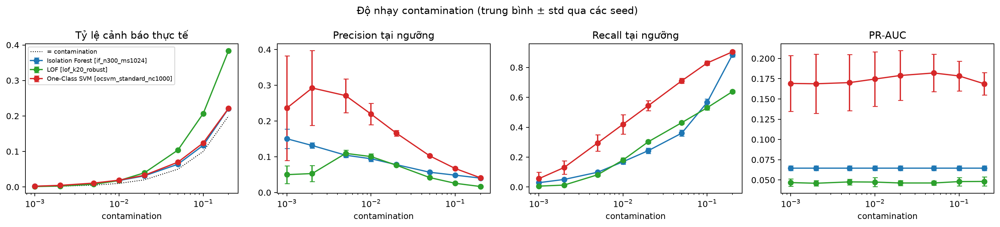
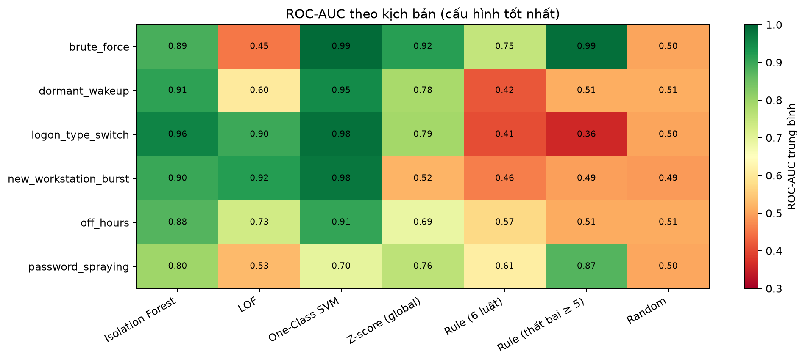

# Báo cáo tóm tắt Tuần 4: Đánh giá & tinh chỉnh

**Nhánh:** `feature/target-rate-1pct` (PR #10) · **Test:** 243 pass
**Đầu ra theo đề cương:** bảng benchmark 3 mô hình × ≥ 3 cấu hình; biểu đồ PR và độ nhạy contamination;
kết quả lặp trên 5 seed kèm độ lệch chuẩn.
**Số liệu gốc:** [`experiments/grid/dev/`](../../experiments/grid/dev/) · [`experiments/grid/test/`](../../experiments/grid/test/) ·
nhật ký chung [`experiments/logs/experiment_log.csv`](../../experiments/logs/experiment_log.csv)
**Hướng dẫn chạy lại:** [`docs/week4_benchmark_grid.md`](../../docs/week4_benchmark_grid.md)

> Bản này thay toàn bộ số liệu của bản trước (commit `24e6c6b`). Kết quả cũ dùng bộ tiêm có lỗi và cách chia
> dev 43–51 / test 52–60; xem §8 về những gì đã sửa và vì sao.

---

## 1. TL;DR

1. **Bộ sinh 6 kịch bản tấn công** (4 kịch bản đề cương + spraying + đổi LogonType), chỉ nhân bản sự kiện thật của train.
   Mỗi run tiêm đúng **1% số dòng (tài khoản, ngày) User**. Đã đối chiếu từng kịch bản với mục 5.2 và sửa 4 chỗ lệch (§2.3).
2. **Chia tập đúng mục 5.1:** test = **ngày 43–60** (30% thời gian, fit trên 1–42). Dev để tinh chỉnh nằm **trong train**:
   ngày 36–42, fit trên 1–35.
3. **Lưới:** 3 mô hình × 3–6 cấu hình × 5 seed, cạnh **4 mốc tham chiếu** (ngẫu nhiên, luật số lần thất bại ≥ 5,
   luật 6 điều kiện, z-score toàn cục). Một seed = một cặp (bộ dữ liệu tiêm, `random_state` mô hình).
4. **Trên test (chạy một lần, cấu hình chốt trên dev):** One-Class SVM đạt PR-AUC **0,182 ± 0,023**, ROC-AUC **0,917**,
   gấp **7 lần luật số lần thất bại** (0,025) và **18 lần ngẫu nhiên** (0,010).
   Với 100 cảnh báo mỗi ngày, OCSVM có **29%** cảnh báo đúng và bắt **33%** nạn nhân.
5. Thứ hạng giữ nguyên giữa dev và test: **OCSVM > IF > LOF > z-score > luật thất bại > luật 6 điều kiện > ngẫu nhiên.**
6. **Không mô hình nào bắt spraying tốt bằng luật thất bại** (ROC-AUC 0,70 so với 0,88): mọi đặc trưng tính theo từng
   tài khoản, nên mô hình không thấy "một nguồn làm nhiều tài khoản thất bại cùng lúc".

## 2. Bộ sinh bất thường

### 2.1. Nguyên tắc

- **Không bịa giá trị trường.** Mọi sự kiện tiêm là bản sao một sự kiện thật của train: của chính nạn nhân nếu có, nếu không thì của tài khoản cùng loại.
- **Hồ sơ hành vi, kho khuôn và luật loại trừ chỉ dựng từ train của khối** (dev: ngày ≤ 35, test: ngày ≤ 42). Train không bị sửa.
- **Tiêm vào log, không vào đặc trưng:** toàn bộ 41 đặc trưng được tính lại trên log đã tiêm, gồm cả đặc trưng lịch sử 7 ngày.
- **Nạn nhân:** tài khoản User có ≥ 7 ngày hoạt động trong train, mỗi tài khoản tối đa một lần; bỏ các (tài khoản, ngày) mà luật ECDF đã cảnh báo sẵn trên log gốc.

### 2.2. Sáu kịch bản (sau khi đối chiếu đề cương)

| Kịch bản | Hành vi được tiêm | Sự kiện / lần (trung vị) | Đề cương 5.2 |
|---|---|---|---|
| `brute_force` | 8–25 lần 4625 từ một nguồn lạ trong 5–30 phút; sau L = 5 lần sai mật khẩu thì bị khoá | 18 | ✔ |
| `password_spraying` | Một nguồn lạ thử 1–3 lần sai trên 5–13 tài khoản; **cả chiến dịch trong một cửa sổ 30–90 phút** | 2 | ✔ (bổ sung) |
| `off_hours` | **Dời toàn bộ một ngày hoạt động điển hình** của người làm ban ngày sang 0–7h | ~110–150 | ✔ "dịch chuyển toàn bộ hoạt động" |
| `new_workstation_burst` | Đăng nhập thành công từ 4–10 máy chưa từng dùng, trong 0,5–2 giờ | 14 | ✔ |
| `dormant_wakeup` | Tài khoản im lặng lâu hơn khoảng nghỉ dài nhất của chính nó, bỗng có một ngày hoạt động điển hình (**giữ giờ gốc**) | 135 | ✔ |
| `logon_type_switch` | **Cả một ngày** đăng nhập của nạn nhân chuyển sang loại logon chưa từng dùng; ưu tiên chiều **2 → 5/3** | ~200 | ✔ một phần (xem dưới) |

**Đổi LogonType:** đề cương mô tả tài khoản vốn dùng type 2 chuyển sang 3/5. Log LANL chỉ có khoảng **35 tài khoản User
dùng chủ yếu type 2**, nên mỗi run chỉ có 5–8 nạn nhân theo đúng chiều này. Phần còn lại bù bằng chiều 3 → 10 (RDP) / 2.

### 2.3. Bốn chỗ đã sửa sau khi đối chiếu đề cương (ngày 2026-10-09)

| Kịch bản | Bản trước | Vấn đề | Bản hiện tại |
|---|---|---|---|
| spraying | Mỗi nạn nhân một cửa sổ thời gian riêng | **Lỗi code:** chiến dịch trải 9–23 giờ, trái "khung thời gian ngắn"; có chiến dịch chỉ 1 nạn nhân | Một cửa sổ chung 30–90 phút; chiến dịch ≥ 5 nạn nhân |
| off_hours | Thêm 10–40 sự kiện đêm vào ngày đã có hoạt động ban ngày | Tỷ lệ ngoài giờ bị pha loãng; ROC-AUC mọi mô hình 0,49–0,57 | Dời cả ngày sang đêm |
| logon_type_switch | Thêm 3–10 sự kiện type 10/2 vào ngày có hàng trăm sự kiện | Tín hiệu khoảng 2%; ngược chiều đề cương | Cả ngày chuyển loại logon; ưu tiên 2 → 5/3 |
| dormant_wakeup | Config ghi "giữ giờ" nhưng code dời ngày tới vị trí ngẫu nhiên | **Lỗi code:** ngày làm việc có thể rơi vào 0–9h, lẫn tín hiệu ngoài giờ | Giữ nguyên giờ trong ngày |

### 2.4. Lượng tiêm

| | Dev (ngày 36–42) | Test (ngày 43–60) |
|---|---|---|
| Mẫu số (dòng User trên log gốc) | 54.656 | 152.740 |
| Số lần tiêm = ⌈1% · D / 0,99⌉ | **553** (92–93 mỗi kịch bản) | **1.543** (257–258 mỗi kịch bản) |
| Tỷ lệ đạt | 1,01% ở cả 5 run | 1,01% ở cả 5 run |
| Sự kiện log được thêm | 62–130 nghìn | 157–198 nghìn |

## 3. Thiết kế thực nghiệm

| Hạng mục | Lựa chọn | Lý do |
|---|---|---|
| Chia tập | **Test = ngày 43–60** (fit 1–42); **dev = ngày 36–42** (fit 1–35) | Mục 5.1: test là 30% thời gian; tinh chỉnh không chạm test |
| Tiền xử lý | Imputer median và scaler **chỉ fit trên train** của phân khúc | Chống rò rỉ |
| Đặc trưng | Schema **v4.1, 41 đặc trưng core** (thêm `delta_mean_share_night_7d`, `novelty_logontype_7d`, §8) | |
| Seed | 5 cặp (run tiêm, `random_state` 42/7/2024/1/2) | Độ lệch chuẩn gồm cả biến động dữ liệu tiêm và mô hình |
| Ngưỡng cảnh báo | Phân vị (1 − contamination) của điểm **train**, contamination = 0,05 | Không dùng nhãn để đặt ngưỡng |
| Chọn cấu hình | PR-AUC trung bình 5 seed cao nhất trên **dev**; test sinh tự động bằng `freeze_test_grid.py` | Không chọn trên test |
| Chỉ số | PR-AUC, ROC-AUC, P@10/50/100 (toàn khối và **theo ngày**), recall tại ngân sách 5%, recall top-N/ngày, tỷ lệ cảnh báo, precision/recall/F1 tại ngưỡng, thời gian | Mục 4.1 #5, 5.4 |
| Nhật ký | Mọi lần fit (lưới và quét contamination) ghi vào `experiments/logs/experiment_log.csv`: thời điểm, commit, cấu hình, run, seed, PR-AUC/ROC-AUC | Mục 5.6 |

**Lưới cấu hình** (`configs/benchmark_grid.yaml`):

| Mô hình | Cấu hình | Tham số quét |
|---|---|---|
| Isolation Forest | 3 | `n_estimators` 150/300, `max_samples` auto/1024, `max_features` 1,0/0,5 |
| LOF (HNSW) | 4 | scaler robust/standard/quantile × `n_neighbors` 20/100 |
| One-Class SVM (Nystroem + SGD) | 6 | scaler robust/standard/quantile, `gamma` scale/0,005/0,1, `n_components` 300/1000 |
| Contamination | 8 mức | **0,1 / 0,2 / 0,5 / 1 / 2 / 5%** (mục 5.6) và 10 / 20%, trên cấu hình tốt nhất của mỗi mô hình (`nu` = contamination với OCSVM) |

**Bốn mốc tham chiếu** (không scale):

| Mốc | Điểm | Ngưỡng |
|---|---|---|
| Ngẫu nhiên | Băm tất định theo nội dung dòng | Phân vị train |
| **Luật số lần thất bại** (mục 5.3, 4.1 #6) | Số lần đăng nhập thất bại trong ngày | **Cố định ≥ 5** (ngưỡng khoá L ước lượng từ train) |
| Luật 6 điều kiện | Tỷ lệ luật thoả (thất bại, khoá, NTLM, ngoài giờ, cùng giây, từ xa) | Phân vị train |
| Z-score toàn cục | max \|z bền vững\| trên 41 đặc trưng | Phân vị train |

## 4. Kết quả trên khối dev (ngày 36–42, User, trung bình ± độ lệch chuẩn qua 5 seed)

Mỗi run dev có khoảng 54.960 dòng đánh giá và 553 nhãn dương (1,01%).

| Mô hình | Cấu hình | PR-AUC | ROC-AUC | P@100/ngày | Recall@5% | Recall top-100/ngày | Tỷ lệ cảnh báo |
|---|---|---|---|---|---|---|---|
| **OCSVM** | **standard, 1000 thành phần** ★ | **0,169 ± 0,021** | 0,908 ± 0,011 | 0,27 | **0,58** | 0,34 | 9,3% |
| OCSVM | standard, γ = scale | 0,167 ± 0,012 | 0,906 ± 0,012 | 0,26 | 0,57 | 0,33 | 9,5% |
| OCSVM | standard, γ = 0,1 | 0,164 ± 0,014 | **0,916 ± 0,012** | 0,25 | 0,56 | 0,31 | 8,2% |
| OCSVM | standard, γ = 0,005 | 0,164 ± 0,004 | 0,904 ± 0,008 | **0,28** | 0,54 | **0,35** | 10,0% |
| OCSVM | quantile | 0,054 ± 0,008 | 0,848 ± 0,011 | 0,09 | 0,31 | 0,11 | 7,2% |
| OCSVM | robust | 0,036 ± 0,012 | 0,512 ± 0,014 | 0,07 | 0,19 | 0,09 | 6,4% |
| **IF** | **n = 300, max_samples = 1024** ★ | **0,063 ± 0,008** | 0,866 ± 0,008 | 0,12 | 0,31 | 0,15 | 8,2% |
| IF | max_features = 0,5 | 0,046 ± 0,003 | 0,848 ± 0,007 | 0,09 | 0,23 | 0,11 | 8,4% |
| IF | mặc định | 0,043 ± 0,003 | 0,846 ± 0,007 | 0,08 | 0,23 | 0,10 | 7,9% |
| **LOF** | **k = 20, robust** ★ | **0,049 ± 0,005** | 0,691 ± 0,016 | 0,13 | 0,33 | 0,16 | 9,1% |
| LOF | k = 20, quantile | 0,043 ± 0,002 | 0,756 ± 0,010 | 0,08 | 0,25 | 0,11 | 7,1% |
| LOF | k = 100, standard | 0,042 ± 0,010 | 0,644 ± 0,022 | 0,10 | 0,22 | 0,13 | 9,6% |
| LOF | k = 20, standard | 0,027 ± 0,008 | 0,597 ± 0,018 | 0,07 | 0,18 | 0,09 | 10,4% |
| *Z-score toàn cục* | — | 0,036 ± 0,009 | 0,727 ± 0,009 | 0,07 | 0,13 | 0,09 | 6,2% |
| *Luật thất bại ≥ 5* | — | 0,027 ± 0,001 | 0,631 ± 0,009 | 0,08 | 0,21 | 0,10 | 4,4% |
| *Luật 6 điều kiện* | — | 0,018 ± 0,001 | 0,605 ± 0,008 | 0,06 | 0,13 | 0,08 | 18,8% |
| *Ngẫu nhiên* | — | 0,011 ± 0,001 | 0,501 ± 0,009 | 0,01 | 0,05 | 0,02 | 5,0% |

★ là cấu hình chốt cho test. Bốn cấu hình OCSVM standard cách nhau nhỏ hơn một độ lệch chuẩn, nên chọn cấu hình nào trong nhóm
này cũng không đổi kết luận. Bảng đầy đủ (P@10/50, F1, thời gian) nằm trong `grid_summary.csv`.

## 5. Kết quả trên khối test (ngày 43–60, chạy một lần)

Năm run test (`test_seed20261061…65`), mỗi run khoảng 153.570 dòng đánh giá và 1.543 nhãn dương (1,01%).
Cấu hình được chốt tự động từ dev (`configs/benchmark_grid_test.yaml`), không chọn lại gì trên test.

### 5.1. Bảng chính

| Mô hình (cấu hình chốt) | PR-AUC test | PR-AUC dev | ROC-AUC | P@10/ngày | P@100/ngày | Recall@5% | Recall top-100/ngày | Tỷ lệ cảnh báo | Fit / suy luận (giây) |
|---|---|---|---|---|---|---|---|---|---|
| **OCSVM** (standard, 1000 tp) | **0,182 ± 0,023** | 0,169 | **0,917 ± 0,005** | **0,29** | **0,29** | **0,64** | **0,33** | 7,0% | 43,0 / 3,4 |
| **IF** (n = 300, ms = 1024) | 0,065 ± 0,003 | 0,063 | 0,888 ± 0,005 | 0,19 | 0,13 | 0,32 | 0,16 | 6,4% | 13,5 / 2,2 |
| **LOF** (k = 20, robust) | 0,047 ± 0,004 | 0,049 | 0,688 ± 0,007 | 0,08 | 0,11 | 0,34 | 0,13 | 10,4% | 12,8 / 3,9 |
| *Z-score toàn cục* | 0,032 ± 0,003 | 0,036 | 0,743 ± 0,003 | 0,21 | 0,06 | 0,15 | 0,07 | 7,2% | 2,1 / 0,1 |
| *Luật thất bại ≥ 5* | 0,025 ± 0,000 | 0,027 | 0,623 ± 0,005 | 0,01 | 0,08 | 0,20 | 0,10 | 5,0% | 1,1 / 0,1 |
| *Luật 6 điều kiện* | 0,015 ± 0,001 | 0,018 | 0,536 ± 0,004 | 0,06 | 0,06 | 0,13 | 0,07 | 36,1% | 1,1 / 0,1 |
| *Ngẫu nhiên* | 0,010 ± 0,000 | 0,011 | 0,503 ± 0,013 | 0,02 | 0,01 | 0,05 | 0,01 | 5,0% | 1,4 / 0,2 |

Thời gian đo trên 314.847 dòng train và khoảng 153.570 dòng đánh giá, 41 đặc trưng, cùng một máy.

### 5.2. Đường Precision–Recall

- **OCSVM** giữ precision khoảng 30% tới recall khoảng 0,35, rồi giảm dần còn khoảng 10% ở recall 0,6 (seed đầu). Đây là vùng vận hành hữu ích nhất.
- **Z-score** có precision rất cao ở đỉnh (P@10/ngày 0,21) nhưng rơi nhanh: nó chỉ bắt một nhóm nhỏ rất lộ, chủ yếu là brute-force.
- **Luật thất bại ≥ 5** có đỉnh precision thấp (P@10/ngày 0,01): những dòng có số lần thất bại cao nhất là **tài khoản thật vốn
  hay thất bại**, không phải nạn nhân tiêm. Đây là lý do một luật đếm thất bại đơn thuần sinh nhiều báo động giả.

### 5.3. Độ nhạy contamination (0,1–5%, mục 5.6)

| c | OCSVM: precision / recall | IF: precision / recall | LOF: precision / recall | Tỷ lệ cảnh báo thực tế (OCSVM) |
|---|---|---|---|---|
| 0,1% | 0,24 / 0,06 | 0,15 / 0,03 | 0,05 / 0,01 | 0,2% |
| 0,2% | **0,29** / 0,13 | 0,13 / 0,05 | 0,05 / 0,01 | 0,5% |
| 0,5% | 0,27 / 0,30 | 0,10 / 0,10 | 0,11 / 0,08 | 1,1% |
| 1% | 0,22 / 0,42 | 0,09 / 0,17 | 0,10 / 0,18 | 1,9% |
| 2% | 0,17 / 0,54 | 0,08 / 0,24 | 0,08 / 0,30 | 3,3% |
| 5% | 0,10 / 0,71 | 0,06 / 0,36 | 0,04 / 0,43 | 7,0% |

- **Contamination chỉ dịch ngưỡng, gần như không đổi chất lượng xếp hạng:** PR-AUC của OCSVM chỉ dao động 0,169–0,182
  dù `nu` = contamination làm chính mô hình thay đổi; IF và LOF không đổi.
- **Chọn contamination là chọn giữa precision và recall.** Ở 0,5%, OCSVM gắn cờ khoảng 1,1% dòng (khoảng 95 cảnh báo mỗi
  ngày trên khoảng 8.500 dòng User), cứ khoảng 4 cảnh báo có 1 tấn công, và bắt 30% nạn nhân.
- **Tỷ lệ cảnh báo thực tế cao hơn contamination khoảng 1,4–2 lần** vì khối đánh giá có thêm 1% dương và lệch nhẹ so với train;
  trên dev mức lệch lớn hơn (đặt 5% thì thực tế 8–9%, §6.4).

### 5.4. Theo từng kịch bản (ROC-AUC, trung bình 5 seed)

| Kịch bản | OCSVM | IF | LOF | Z-score | Luật thất bại | Luật 6 đk | Ngẫu nhiên |
|---|---|---|---|---|---|---|---|
| brute_force | **0,994** | 0,886 | 0,453 | 0,915 | 0,988 | 0,751 | 0,500 |
| logon_type_switch | **0,985** | 0,957 | 0,896 | 0,791 | 0,359 | 0,406 | 0,501 |
| new_workstation_burst | **0,975** | 0,900 | 0,919 | 0,521 | 0,495 | 0,459 | 0,491 |
| dormant_wakeup | **0,947** | 0,911 | 0,604 | 0,785 | 0,513 | 0,418 | 0,513 |
| off_hours | **0,906** | 0,877 | 0,730 | 0,687 | 0,510 | 0,571 | 0,508 |
| password_spraying | 0,696 | 0,797 | 0,529 | 0,759 | **0,875** | 0,613 | 0,503 |

So với bộ tiêm cũ, **off_hours tăng từ 0,49 lên 0,91** và **logon_type_switch từ 0,44 lên 0,99** (OCSVM). Hai kịch bản này
trước đây không phát hiện được vì cách tiêm, không phải vì mô hình (§2.3).

## 6. Phân tích

### 6.1. Vì sao One-Class SVM vượt LOF, trái với nhiều bài báo

Nhiều bài so sánh xếp OCSVM ở nhóm kém. Kết quả ngược lại ở đây có ba nguyên nhân, và hai trong số đó đã được kiểm chứng trên dữ liệu:

1. **Loại bất thường quyết định thuật toán thắng.** Kết luận "OCSVM kém" là kết luận trung bình trên nhiều bộ dữ liệu.
   Các khảo sát lớn (ví dụ ADBench, Han và cộng sự, NeurIPS 2022) cho thấy phương pháp toàn cục thắng với **bất thường toàn cục**
   (giá trị cực trị so với cả quần thể), còn LOF chỉ mạnh với **bất thường cục bộ** (lệch so với vài láng giềng). Năm trên sáu
   kịch bản tiêm ở đây là bất thường toàn cục: bị khoá tài khoản, nhiều máy nguồn mới, cả ngày đổi loại logon.
2. **Bằng chứng trực tiếp: LOF kém hơn ngẫu nhiên trên brute-force (ROC-AUC 0,45), OCSVM đạt 0,994.**
   Train (ngày 1–42) có sẵn **601 dòng User thật giống brute-force** (bị khoá, ≥ 8 lần thất bại). Một nạn nhân tiêm có
   láng giềng gần nhất chính là các dòng này; mật độ tương đương nên LOF ≈ 1, tức "bình thường". OCSVM với kernel rộng
   đo khoảng cách tới khối dữ liệu chính, và 601 trên 315.000 dòng là vùng rất thưa, nên bị coi là bất thường.
3. **Tiền xử lý và tinh chỉnh.** Bài báo thường dùng tham số mặc định. Riêng việc đổi `RobustScaler` sang `StandardScaler`
   đã nâng PR-AUC của OCSVM từ 0,036 lên 0,167 trên dev (§6.2).

**OCSVM không thắng ở mọi chỗ:** trên spraying IF (0,80) và luật thất bại (0,88) đều tốt hơn OCSVM (0,70); z-score có
precision rất cao ở vài cảnh báo đầu (P@10/ngày 0,21 so với 0,29 của OCSVM). Khuyến nghị vì vậy là phối hợp: OCSVM làm điểm chính, luật thất bại làm kênh riêng cho dò mật khẩu.

### 6.2. RobustScaler làm hỏng LOF/OCSVM

`RobustScaler` chia mỗi đặc trưng cho IQR train. Trên dữ liệu này, đặc trưng có IQR rất nhỏ bị phóng đại
(`failure_ratio` lên tới khoảng 1.400 đơn vị), còn 9 đặc trưng có IQR = 0 bị giữ nguyên đơn vị gốc, gồm chính các đặc trưng
tách nạn nhân tốt nhất. Mô hình dựa trên khoảng cách vì vậy chỉ "thấy" vài đặc trưng bị phóng đại.
OCSVM robust có ROC-AUC 0,51 (dev), standard đạt 0,91. Isolation Forest không bị ảnh hưởng vì không phụ thuộc thang đo.

Riêng LOF, cấu hình robust lại tốt nhất về PR-AUC (0,049) nhưng ROC-AUC thấp (0,69): nó bắt mạnh vài kịch bản có đặc trưng
bị phóng đại và bỏ qua phần còn lại. Đây là một lý do khác khiến LOF xếp sau.

> **Bài học:** với đặc trưng UEBA (nhiều tỷ lệ bằng 0, đuôi dài), scaler "an toàn" theo sách giáo khoa có thể là lựa chọn sai.
> Cần kiểm tra thang đo sau tiền xử lý trước khi kết luận một mô hình kém.

### 6.3. Spraying: giới hạn của đặc trưng theo từng tài khoản

Với mỗi nạn nhân spraying chỉ có 1–3 lần thất bại. Dấu hiệu thật của spraying là **một nguồn làm nhiều tài khoản thất bại
trong cùng khung giờ**, nhưng cả 41 đặc trưng đều tính trên một (tài khoản, ngày). Luật thất bại thắng ở đây vì nó không cần
so với quần thể: bất kỳ thất bại nào ở người vốn không thất bại cũng đẩy điểm lên. Hướng sửa là đặc trưng "fan-out" của
nguồn (template engine đã có phép đo `fanout`), thuộc tuần 5.

### 6.4. Tỷ lệ cảnh báo vượt ngân sách trên dev

Với contamination 5%, tỷ lệ cảnh báo thực tế là 8–10% trên dev (ngày 36–42, fit 1–35) và 6–7% trên test. Phần vượt chỉ khoảng
1 điểm phần trăm là do 1% dương tiêm; phần còn lại cho thấy ngày 36–42 lệch phân phối so với ngày 1–35 nhiều hơn ngày 43–60
so với 1–42. Ngưỡng đặt theo phân vị train vì vậy không giữ đúng ngân sách khi dữ liệu trôi; cần theo dõi tỷ lệ cảnh báo
theo ngày khi triển khai (tiêu chí mở rộng "ổn định theo thời gian").

### 6.5. Mức lạc quan do chọn cấu hình trên dev là nhỏ

PR-AUC test bằng hoặc cao hơn dev cho cả ba mô hình (OCSVM 0,182 so với 0,169), vì lưới nhỏ và khoảng cách giữa các cấu hình
tốt lớn hơn nhiễu. Dev nằm trong train nên test hoàn toàn không được dùng để chọn gì.

## 7. Đối chiếu với đề cương (`docs/Tong quan de tai ueba.md`)

**Đầu ra tuần 4:**

| Yêu cầu | Trạng thái | Bằng chứng |
|---|---|---|
| Bộ sinh bất thường: brute-force, ngoài giờ, bùng nổ máy trạm mới, ngủ đông | ✅ Đủ 4, thêm spraying và đổi LogonType; đã đối chiếu từng kịch bản với mục 5.2 | §2 |
| Tiêm vào tập kiểm thử theo tỷ lệ định trước (0,5–1%) | ✅ 1,01% ở cả 10 run | `run_config.json` |
| Toàn bộ chỉ số mục 5.4 | ✅ gồm P@k theo ngày | `grid_runs.csv` |
| Quét contamination, n_estimators, n_neighbors, nu, gamma | ✅ | §3 |
| **Bảng 3 mô hình × ≥ 3 cấu hình** | ✅ IF 3, LOF 4, OCSVM 6 | §4 |
| **Biểu đồ PR** | ✅ dev và test | `figures/pr_curves.png` |
| **Biểu đồ độ nhạy contamination 0,1–5%** | ✅ 8 mức | `figures/contamination_sensitivity.png` |
| **5 seed kèm độ lệch chuẩn** | ✅ mọi chỉ số | `grid_summary.csv` |

**Tiêu chí liên quan (mục 4.1):** #4 ✅, #5 ✅, #6 ✅ (ngẫu nhiên + luật số lần thất bại ngưỡng cố định), mục 5.1 chia 70/30 ✅,
mục 5.6 nhật ký chung ✅.

**Điểm lệch còn lại, cần nói rõ khi báo cáo:**

1. **Thuật toán xấp xỉ:** LOF dùng láng giềng xấp xỉ HNSW, OCSVM dùng nhân RBF xấp xỉ Nystroem + SGD thay cho bản chính xác
   của scikit-learn (mục 2.1). OCSVM RBF chính xác có độ phức tạp bậc 2–3 theo số mẫu, không chạy được trên 315.000 dòng.
2. **Z-score** lấy max |z| trên 41 đặc trưng thay vì một đặc trưng duy nhất (mục 5.3).
3. **Đổi LogonType** chỉ có 5–8 nạn nhân mỗi run theo đúng chiều 2 → 5/3, vì log thiếu tài khoản chủ yếu dùng type 2.
4. **LOF đa luồng không hoàn toàn tất định** (sai lệch PR-AUC tới khoảng 0,006 giữa hai lần chạy), cần lưu ý cho tiêu chí tái lập < 1%.
5. **Chưa có một lệnh duy nhất** chạy từ tiêm đến lưới (tiêu chí #1): hiện là chuỗi các lệnh trong `docs/week4_benchmark_grid.md`.

## 8. Các thay đổi trong tuần

- **Bộ tiêm:** sửa 4 kịch bản theo §2.3 (2 lỗi code, 2 lệch thiết kế).
- **Chia tập:** test 43–60, dev 36–42 trong train; khối có thể ghi đè `common` (mốc chia, hồ sơ, luật loại trừ), lưới lấy mốc chia từ run.
- **Đặc trưng v4.1:** đưa 2 đặc trưng dự bị của phễu v4 vào core (39 → 41). Chẩn đoán trên tập con: off_hours ROC-AUC của OCSVM
  0,84 → 0,91. Ghi chú: AUC của phễu v4 được đo trên bộ tiêm cũ và không chuyển sang bộ tiêm mới.
- **Baseline luật số lần thất bại** (ngưỡng cố định 5), quét contamination 0,1–5%, P@k theo ngày, ghi lưới vào nhật ký chung.
- `zscore_baseline` của benchmark là **z-score toàn cục**; kết quả run tiêm nằm ở `experiments/injection_runs/<run_id>/`.

## 9. Hạn chế đã biết

1. **Nhãn tổng hợp chỉ cho cận trên lạc quan** (mục 5.4): tấn công thật đa dạng và kín đáo hơn; dòng nhãn 0 cũng chưa chắc lành tính.
2. **Giả định train "sạch"** (mục 2.3): train có 601 dòng giống brute-force thật, chính là thứ làm LOF thất bại (§6.1).
3. **Chỉ phân khúc User được đánh giá**, vì tài khoản máy không được tiêm.
4. **Cấu hình được chọn bằng nhãn dev,** nhưng dev nằm trong train và test không tham gia chọn.
5. **Train dùng chung cho mọi run** (chỉ ngày đánh giá bị tiêm), nên độ lệch chuẩn không gồm biến động của train.

## 10. Kế hoạch tuần 5

1. **Phân tích theo loại bất thường** (đã có `grid_scenarios*.csv`) và thêm đặc trưng fan-out cho spraying.
2. **Review thủ công top 50 cảnh báo** của từng mô hình trên log gốc, đo mức đồng thuận giữa hai người.
3. **Ablation theo nhóm đặc trưng** (tần suất, thời gian, đa dạng thực thể, độ lệch lịch sử).
4. **Tái lập:** một lệnh duy nhất chạy toàn bộ chuỗi; chạy lại trên máy sạch, sai lệch ≤ 1%.
